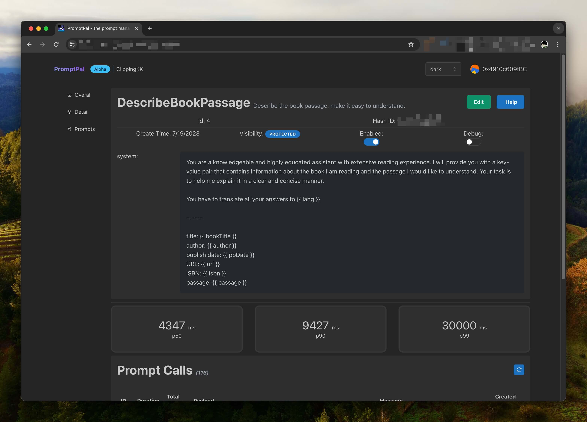

import ReleaseHero from "@site/src/components/ReleaseHero";

<ReleaseHero
    version='1.7'
    features={[
        'Single Sign-On',
        'Prompt Tracking',
        'More improvements and bugfixes'
    ]}
/>

## PromptPal 1.7: Single Sign-On, Improved Tracking, and Bug Fixes

We're excited to announce the release of PromptPal 1.7! This update introduces several new features and improvements.

### Single Sign-On (SSO) with Google Login

PromptPal now supports seamless integration with Google Login. You can easily enable Google Login by configuring your `.env` file. Simply follow these steps:

1. Visit the Google Cloud Console: [https://console.cloud.google.com/apis/credentials](https://console.cloud.google.com/apis/credentials) to create an OAuth 2.0 client and set up a callback URL.
2. Update your PromptPal `.env` file with the following details:

```yaml
SSO_GOOGLE_CALLBACK_URL="http://localhost:7788/auth/google"
SSO_GOOGLE_CLIENT_ID="YOUR_CLIENT_ID"
SSO_GOOGLE_CLIENT_SECRET="YOUR_CLIENT_SECRET"
```

**Important Note:** You can only modify the host portion of the callback URL (`http://localhost:7788` in this example). The path (`/auth/google`) must remain unchanged.

Once configured, a "Google Login" button will appear on your login page.

### Enhanced Prompt Tracking

The latest version of PromptPal provides deeper insights into how prompts are being used within your project. You can now view:

- The number of times each prompt has been called in the last 7 days.
- The P50, P90, and P99 response times for each prompt.



### Improvements and Bug Fixes

For a detailed list of improvements and bug fixes, please refer to the full changelog: Release 1.7 Changelog: [https://github.com/PromptPal/PromptPal/releases/tag/v1.7.0](https://github.com/PromptPal/PromptPal/releases/tag/v1.7.0).

## Important Updates Regarding Database Support

We've made the difficult decision to discontinue support for SQLite in PromptPal 1.7. Here's why:

1. **Reduced Bundle Size:** We prioritize keeping the bundle size small, especially for users in regions with limited internet bandwidth. Removing SQLite support significantly reduces the overall size of the package (by approximately 83%).
2. **cgo Limitations:** SQLite relies on cgo, which can introduce challenges in certain environments. You can learn more about these limitations in this article: cgo is not Go: [https://dave.cheney.net/2016/01/18/cgo-is-not-go](https://dave.cheney.net/2016/01/18/cgo-is-not-go).
3. **Limited Functionality:** SQLite offers a restricted set of aggregate functions, hindering our ability to develop certain features.

We recommend migrating your data to PostgreSQL, our officially supported database.

## Upgrading to PromptPal 1.7

Upgrading is a simple process:

1. Update the image version:

```bash
docker run -v $(pwd)/.env:/usr/app/.env -p 7788:7788 annatarhe/prompt-pal:v1.7.0
```

2. If you intend to use Google Login, update your `.env` file accordingly before starting the server.
3. Users who were previously using SQLite will need to migrate their data to a different database (such as PostgreSQL).

We appreciate your understanding and patience. We're confident that these changes will enhance the overall performance and functionality of PromptPal. We look forward to your continued use and feedback!

