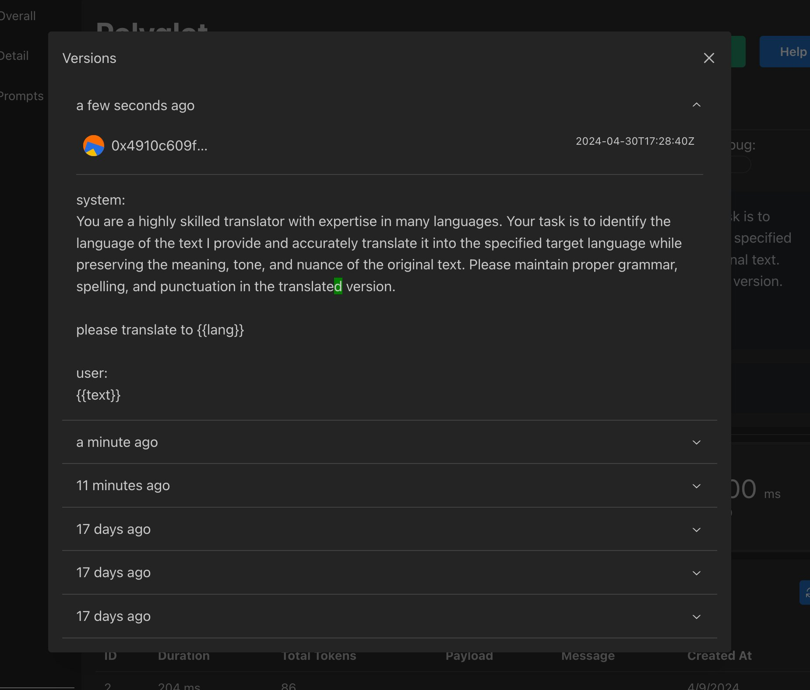

import ReleaseHero from "@site/src/components/ReleaseHero";

<ReleaseHero version="1.8" features={["Versions"]} />

# Introducing PromptPal 1.8 - Your Ultimate AI Integration Manager

We are thrilled to unveil the latest version of PromptPal - version 1.8! This release brings forth a plethora of new features and enhancements aimed at simplifying the debug process for developers.

## Version Control Made Easy

One of the key highlights of PromptPal 1.8 is the introduction of versioning support. With this new feature, you can now easily track and manage all the changes made within a prompt. This not only enhances transparency but also provides a streamlined approach to monitoring alterations.

Check out the example below:



## How to Upgrade

To leverage all the new capabilities and improvements of PromptPal 1.8, simply execute the following command to upgrade to the latest version:

```bash
docker run -v $(pwd)/.env:/usr/app/.env -p 7788:7788 annatarhe/prompt-pal:v1.8.0
```

That's it! Stay tuned for more exciting features in the pipeline. We hope you find PromptPal 1.8 as beneficial and efficient as we intended it to be. Happy integrating!
