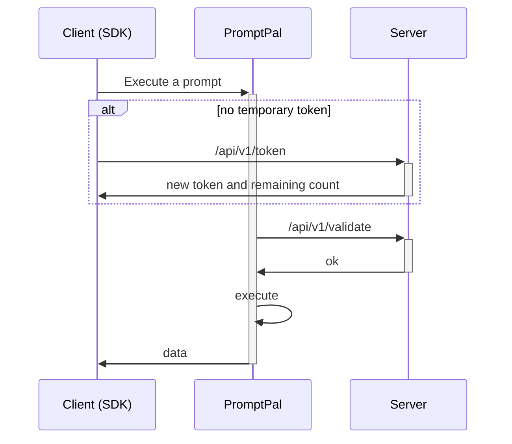
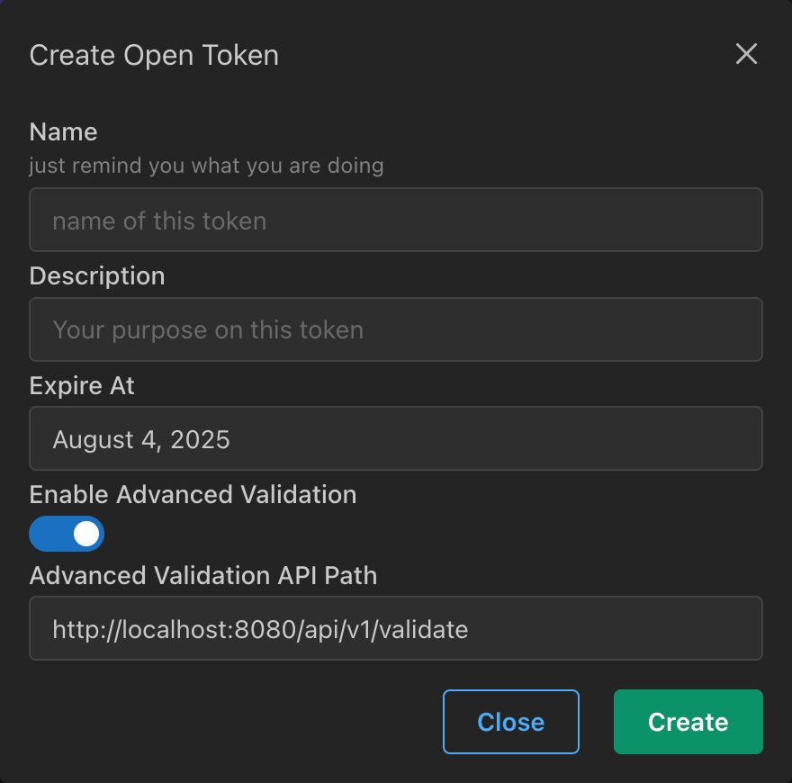

:::info

This feature was released in version 1.12.

:::

Ensuring the security of the API is vital for PromptPal. We designed a workflow to allow you to safely use JavaScript and Golang SDK clients on the client side.

In essence, your server provides two APIs: one to grant a temporary token and another to validate the token.



# Integration

To use this advanced security feature, you ~~may (not) need to subscribe to the business plan (for now)~~ and enable this feature for each Open Token.



Next, implement two APIs: `POST /api/v1/token` and `POST /api/v1/validate`. The first API can be customized as needed because it is defined in the SDK. The SDK will use this method to obtain a valid token if one does not exist.

Here's how it looks in the JS SDK:

```ts
// Add the package to your client with:
// `pnpm dlx jsr add @prompt-pal/node-sdk`
import PromptPal from '@prompt-pal/node-sdk'

const client = new PromptPal(endpoint, token, {
    applyTemporaryToken: () => Promise<{
        token: string,
        limit: number,
        remaining: number
    }>
})
```

The second API method is hardcoded, but you can change the path on the OpenAPI Token page. An example is shown above.

You also need to expose an API for PromptPal to validate the token.

## POST /api/v1/validate

```ts
type Headers = {
    'user-agent': string
    'authorization': string
}
```

```ts
type Response = {
    limit: number
    remaining: number
}
```

If the response status is not 200, PromptPal will throw an Unauthorized error to the SDK, and the SDK will call the method to apply for another token.

Here is an example of a validation server:

```ts
Deno.serve({ port: 8080 }, (req) => {
  // ua === `PromptPal@{{COMMIT_ID}}`
  const ua = req.headers.get("user-agent")
  // YOUR TOKEN HERE
  const token = req.headers.get("authorization")

  const body = {
    limit: 100,
    remaining: token === "Bearer hello-from-temp-token" ? 100 : 0,
  }
  return new Response(JSON.stringify(body), {
    headers: {
      "Content-Type": "application/json",
    },
  })
})
```

If the response returns an OK status and the `remaining` field is more than 1, the process will continue to the next steps.

With this advanced security feature, you can safely call prompts on the client side. We hope you find it useful!

If you have any questions, don't hesitate to ask: annatar.he+pp@gmail.com