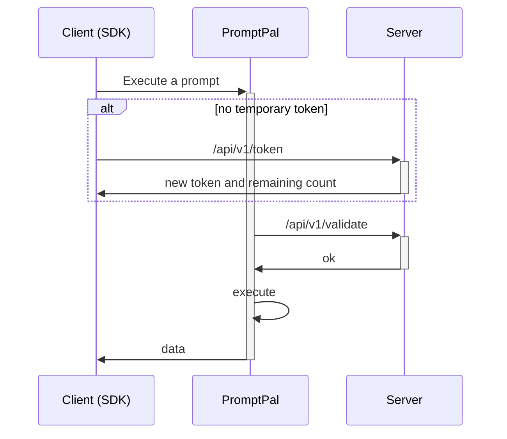

:::warning

this feature is still in heavy development, please wait for next release.

:::


The security of the API is vital for PromptPal. So, we designed a workflow to let you use JavaScript and Golang SDK clients safely on the client side.

Basically, your server provides 2 APIs: one that grants a temporary token and a validation API to check if the token is valid.



# Integration

If you want to use this advanced security feature, ~~you may (not) need to subscribe to the business plan (for now)~~ and then enable this feature on every Open Token.

~~TODO: ADD AN IMAGE HERE~~

After that, you need to implement 2 APIs: `POST /api/v1/token` and `POST /api/v1/validate`. The first API can be freely changed as you want because it can be defined in the SDK. The SDK will use the method to get a valid token if it does not exist.

It looks like this in the JS SDK:

```ts
import PromptPal from '@prompt-pal/node-sdk'

const client = new PromptPal(endpoint, token, {
    applyTemporaryToken: () => Promise<{
        token: string,
        limit: number,
        remaining: number
    }>
})
```

The second API method is hardcoded. You can change the path in the OpenAPI Token page. An example is above.

You also need to expose an API for PromptPal to validate the token.

## POST /api/v1/validate

```ts
type Payload = {
    token: string
}
```

```ts
type Response = {
    limit: number
    remaining: number
}
```

If the response status is not 200, PromptPal will throw an Unauthorized error to the SDK, and the SDK will call the method to apply for another token.

If the response replies with an OK status, it will continue to the next steps.

With this advanced security feature, you can safely call prompts on the client side. Hope you like it!